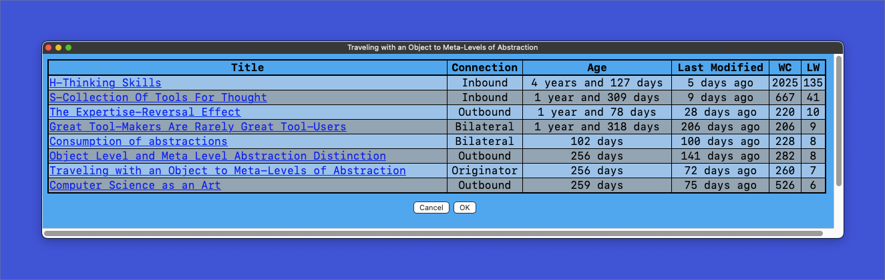

# Zettelkasten Idea Explorer  
**Script in development**  
**README document in development**  
Designed with The Archive, zettelkasting application, in mind. Plain text with wikilinks. 
My ideas ares for this script are modeled after [the public musings of Soren Bjornstad](https://zettelkasten.sorenbjornstad.com/#ImprovementOfDailyWork)  
The Idea Explorer is an idea that can help surface interesting relationships by looking at age and modification times, and the prevalence of incoming and outgoing links. There is likely other relevance that can be "fished out of the idea pond."

## Install
- Tested on Python 3.9
- Dependencies are in requirements.txt

## Use
- The script will find your active zettelkasten
- Currently, the script requires Keyboard Maestro. The Keyboard Maestro macros are in the repository. The usual changes are needed in the macros. File locations and triggers.
- In the file `main custom.html` change the location of your copy of `style.css`.
- To activate, with The Archive in the foreground, trigger Keyboard Maestro's 'Idea Explorer'. The initial launch will take up to 10 seconds, so be patient. Subsequent triggers will be much shorted. 

## Notes on work to do:

1. I want to add to the Idea Explorer if the target note in proofing.
2. I want to prettify the Idea Explorer.
3. I want to think of some way to present the data that will be pleasing given the width restriction of the editor.
4. Add Subatomic flags 
5. Indicate somehow when the target note is connected to multiple hubs. "Intra-hub connections."
6.  Indicate if media is present and the possible link.
7.  Create HTML tabs in that would allow a group tag cloud.

## This is the current status.
- The example is for a note about the spectrum of abstractions when building knowledge.
- Each note is a link.
- Connection type is defined.
- Age is the relative creation time.
- Last Modified and word count are self-explanatory.
- LW stands for 'Link Weight' and this piecce of data is what the Idea Explorer is sorted on. The more links the higher the rating.

 

## Me
I'm a mediocre programmer.  
I'm a list maker and love note-taking.  
It is something I love doing.  
I may have found a tutor.  
If you can help, please contact me.