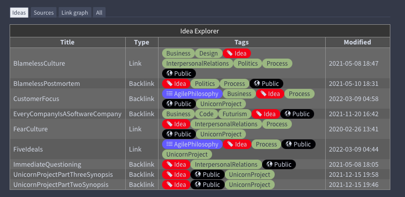
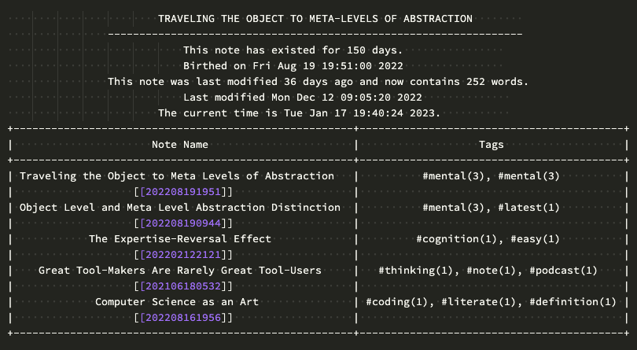

# Zettelkasten Idea Explorer  
**Script in development**  
**README document in development**  
Designed with The Archive, zettelkasting application, in mind. Plain text with wikilinks. 
My ideas for this script are modeled after [the public musings of Soren Bjornstad](https://zettelkasten.sorenbjornstad.com/#ImprovementOfDailyWork)  
The Idea Explorer or Navigator is an idea that can help surface interesting relationships by looking at common tags, age and modification times, and the prevalence of incoming and outgoing links. There is likely other relevance that can be "fished out of the idea pond."



## Install
- Tested on Python 3.9.13
- Dependencies are in requirements.txt

## Use
- The script will find your active zettelkasten
- Currently, the script requires you manually place the file name of the note you want to create an Idea Explorer on (referred to as the Target Note) in the "zettel" variable spot. This is located near the top of the script in the Variable section.
- From a terminal cd to the directory containing the script.
```
python ./main.py
```
- The output will appear on stdout.

## Notes on work to do:
1. I want to add a column with the modified times of each file
2. I want to add a column with the link type, incoming or outgoing.
3. I want to add to the Target Note Explorer if the target note is a hub or subhub.
4. I want to add to the Target Note Explorer if the target note in proofing.
5. I want to prettify the Target Note Explorer.
6. I want to think of some way to present the data that will be pleasing given the width restriction of the editor.
7. Add Subatomic flags for the target note 
8. Indicate what types of note the target note is. For example book, hub, class note, article, etc.
9. Indicate somehow when the target note is connected to multiple hubs. "Intra-hub connections."
10. Indicate if media is present and the possible type.


## This is the current status.
- The example is for a note about the spectrum of abstractions when building knowledge.
- The part above the table is what I'm calling the "Target Note Explorer."




## Me
I'm a mediocre programmer.  
I'm a list maker and love note taking.  
It is something I love doing.  
I may have found a tutor.  
If you can help, please contact me.